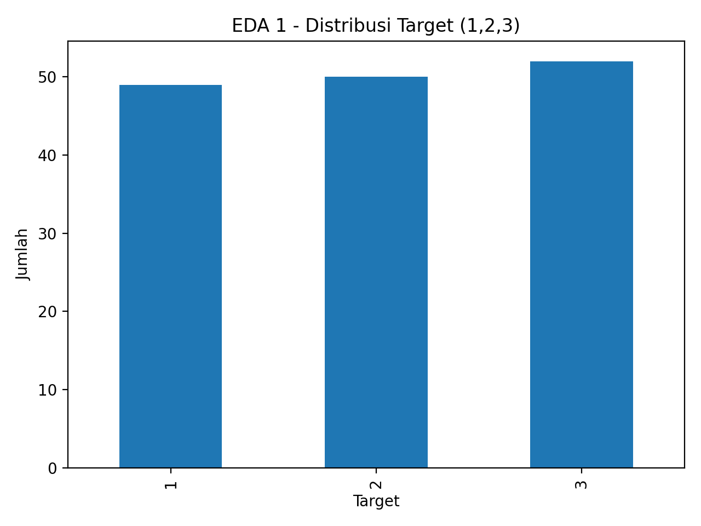
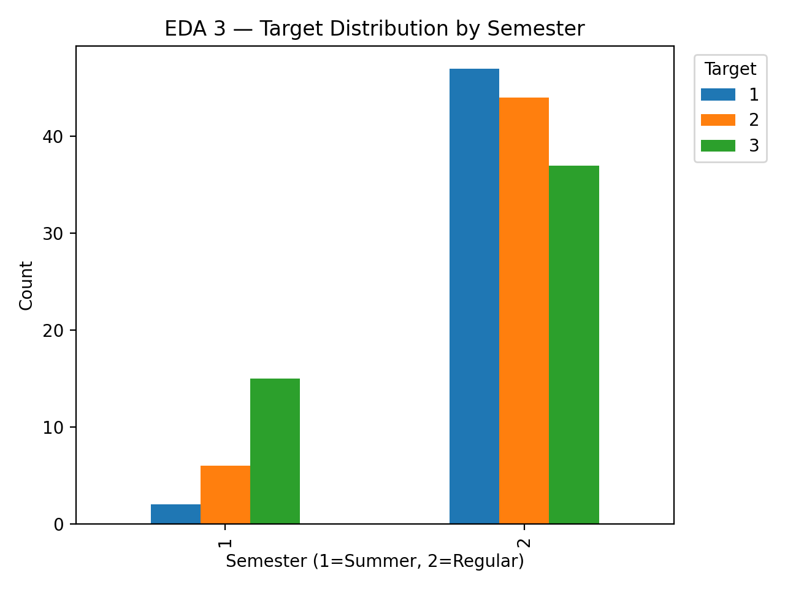
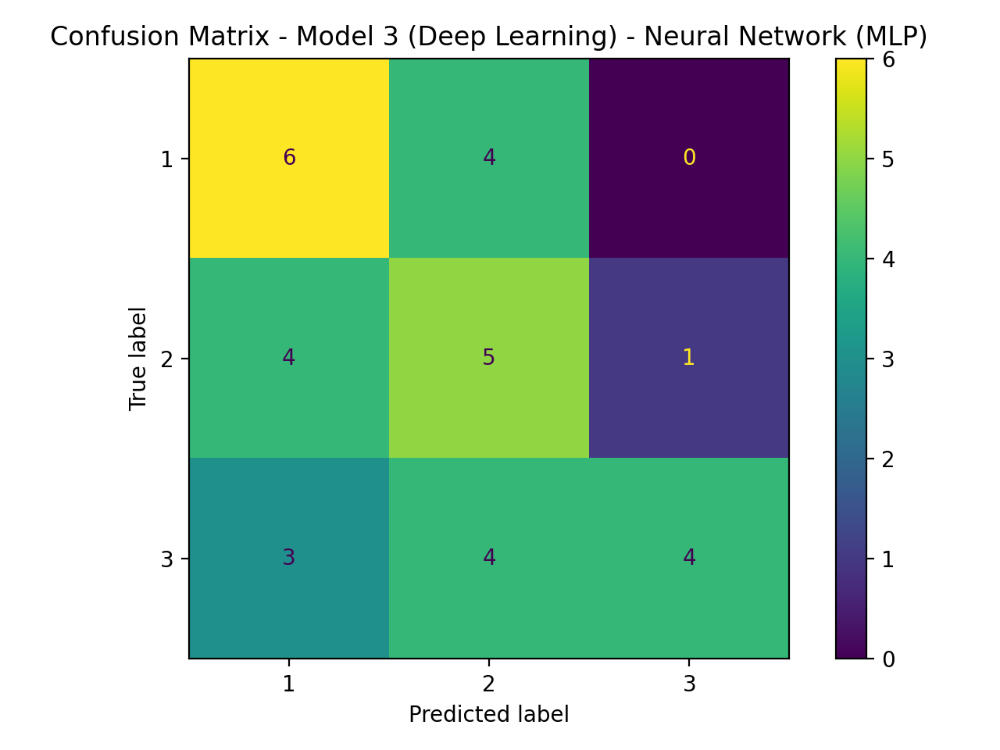

# Perbandingan Metode Machine Learning dan Deep Learning untuk Klasifikasi Target pada Dataset TAE

## 👤 Informasi
- **Nama:** *Elda Serlya Dwi Seviana*
- **NIM:** *233307044*
- **Mata Kuliah:** TI22406 – Data Science
- **Dosen Pengampu:** Gus Nanang Syaifuddiin, S.Kom., M.Kom.
- **Link Video Penjelasan:** *https://youtu.be/NU7q8FXPBPE*

---

## 1. 🎯 Ringkasan Proyek
Proyek ini membandingkan performa **Machine Learning** dan **Deep Learning** untuk tugas **klasifikasi target (1/2/3)** pada **Teaching Assistant Evaluation (TAE) dataset**.  
Alur kerja meliputi:
- Data understanding & data preparation (One-Hot Encoding + StandardScaler + split stratify)
- **EDA minimal 3 visualisasi**
- Training **3 model**: Baseline, Advanced ML, Deep Learning (MLP)
- Evaluasi performa (Accuracy, F1-macro) + Confusion Matrix

---

## 2. 📌 Problem & Goals

### Problem Statements
1. Bagaimana memprediksi **target evaluasi asisten dosen (1/2/3)** dari fitur perkuliahan?
2. Metode mana yang lebih baik untuk data tabular kecil: **ML klasik** atau **Deep Learning**?
3. Bagaimana perbandingan performa antar 3 pendekatan model?

### Goals
1. Membangun 3 model klasifikasi: **Logistic Regression**, **Random Forest**, dan **Neural Network (MLP)**.
2. Mengevaluasi performa model menggunakan metrik klasifikasi.
3. Menentukan **model terbaik** berdasarkan metrik evaluasi dan memberikan insight dari EDA + hasil model.

---

## 3. 📊 Dataset
- **Nama Dataset:** Teaching Assistant Evaluation (TAE)
- **Jumlah Data:** 151 baris
- **Jumlah Kelas Target:** 3 kelas (1, 2, 3)
- **Lokasi File:** `data/tae.data`

### Fitur
| Kolom | Tipe | Deskripsi Singkat |
|---|---|---|
| `english_speaker` | Kategorikal | status english speaker |
| `instructor` | Kategorikal | ID instructor |
| `course` | Kategorikal | ID mata kuliah |
| `semester` | Kategorikal | semester (summer/regular) |
| `class_size` | Numerik | jumlah mahasiswa |
| `target` | Label | kelas evaluasi (1/2/3) |

---

## 4. 🧹 Data Preparation
Tahapan yang digunakan:
- Memisahkan fitur dan label: `X = df.drop("target")`, `y = df["target"]`
- **Encoding fitur kategorikal** dengan `OneHotEncoder(handle_unknown="ignore")`
- **Scaling fitur numerik** (`class_size`) dengan `StandardScaler()`
- Menggabungkan preprocessing dengan `ColumnTransformer`
- **Train-test split**: `test_size=0.2`, `random_state=42`, `stratify=y`

---

## 5. 📈 Exploratory Data Analysis (EDA) — Minimal 3
Visualisasi disimpan ke folder `images/` dan dibuat dari kode EDA di notebook (bukan dari sumber eksternal).

1) **Distribusi target**
- File: `images/eda_1_target_distribution.png`

2) **Sebaran class_size per target (boxplot)**
- File: `images/eda_2_class_size_by_target.png` *(atau versi boxplot yang ada di repo)*

3) **Distribusi target berdasarkan semester**
- File: `images/eda_3_target_by_semester.png`

Contoh tampilan di README (menampilkan dari folder `images/`):




---

## 6. 🤖 Modeling

### Model 1 — Baseline (Logistic Regression)
- Pipeline: `preprocess` → `LogisticRegression(max_iter=3000)`
- Output evaluasi: Accuracy, F1-macro, Classification Report, Confusion Matrix

### Model 2 — Advanced/ML (Random Forest)
- Pipeline: `preprocess` → `RandomForestClassifier(n_estimators=400, random_state=42)`
- Output evaluasi: Accuracy, F1-macro, Classification Report, Confusion Matrix

### Model 3 — Deep Learning (Neural Network / MLP)
- Input: hasil transform `preprocess` menjadi **array numerik (dense)**
- Arsitektur:
  - Dense(64, ReLU) + Dropout(0.2)
  - Dense(32, ReLU)
  - Dense(3, Softmax)
- Training: `epochs=30`, `batch_size=16`, `validation_split=0.2`
- Output tambahan: grafik `nn_loss.png` dan `nn_accuracy.png`

---

## 7. 🧪 Evaluation

### 7.1 Metrik Evaluasi
- **Accuracy**: proporsi prediksi benar dari seluruh data uji.
- **F1-macro**: rata-rata F1-score untuk tiap kelas (menganggap semua kelas sama penting).

### 7.2 Ringkasan Hasil Evaluasi (Test Set)
| Model | Accuracy | F1-macro |
|---|---:|---:|
| Random Forest | **0.645161** | **0.644444** |
| Logistic Regression | 0.516129 | 0.511202 |
| Neural Network (MLP) | 0.483871 | 0.485507 |

**Model terbaik (berdasarkan Accuracy dan F1-macro): Random Forest.**

### 7.3 Confusion Matrix (Per Model)
File confusion matrix ada di folder `images/`:

- Model 1 (Baseline): `images/cm_model_1_baseline_logistic_regression.png`
- Model 2 (Advanced/ML): `images/cm_model_2_advanced_ml__random_forest.png`
- Model 3 (Deep Learning): `images/cm_model_3_deep_learning__neural_network_mlp.png`

Tampilan:




### 7.4 Output Evaluasi Tambahan (Deep Learning)
- `images/nn_loss.png` (Loss train vs validation)
- `images/nn_accuracy.png` (Accuracy train vs validation)

---

## 8. 🏁 Kesimpulan
- **Model terbaik:** Random Forest (Accuracy dan F1-macro tertinggi).
- **Alasan utama:** prediksi lebih stabil pada 3 kelas dibanding Logistic Regression dan MLP pada data tabular kecil ini.
- **Catatan:** MLP tidak otomatis lebih baik untuk dataset kecil; performa sangat bergantung pada jumlah data, tuning, dan kompleksitas model.

---

## 9. 🔁 Reproducibility 

### 9.1 Struktur Folder
DataSince_Project_UAS/
├── data/
│ └── tae.data
├── images/
├── models/
├── notebooks/
├── src/
├── requirements.txt
├── .gitignore
└── README.md

### 9.2 Cara menjalankan di colab
1) Clone repo:
```bash
!git clone https://github.com/eldaserlya/DataSince_Project_UAS.git
%cd DataSince_Project_UAS
2) Install Dependensi !pip install -r requirements.txt

## 10. Dependencies
requirements.txt

